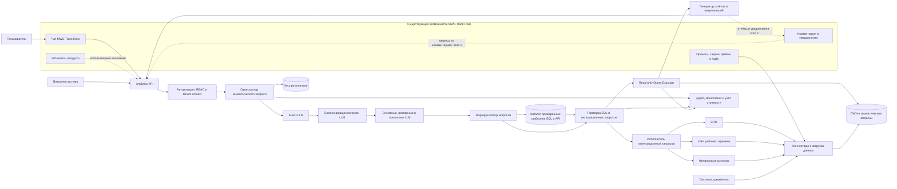

# Проектирование ИИ-сервиса аналитики для MWS Track Rails

## 1. Идея решения

Пользователь задаёт вопрос на естественном языке во встроенном чате MWS Track Rails
или через API. ИИ определяет нужные сущности, метрики, фильтры и формат результата,
после чего формирует безопасный запрос к данным. Сервис возвращает таблицу, график,
дашборд или текстовый отчёт с пояснением использованных данных и расчётов.

## 1.1. Пользовательские сценарии

### Сценарий 1. Отчёт по просроченным задачам

**Пользователь:** руководитель подразделения или проекта.

**Запрос:** «Покажи отчёт по просроченным задачам за последний квартал по командам
с диаграммой распределения причин задержек».

**Обработка:** сервис определяет период, доступные пользователю команды и критерий
просрочки. Затем получает задачи и причины задержек, группирует данные по командам
и строит агрегаты.

**Результат:** таблица с количеством просроченных задач по командам, диаграмма причин
задержек и пояснение применённых фильтров. Из отчёта можно перейти к списку задач.

### Сценарий 2. Задачи и выручка по клиентам

**Пользователь:** руководитель клиентского направления или аккаунт-менеджер.

**Запрос:** «Собери сводный отчёт по задачам из MWS Track Rails и выручке из CRM
за последний месяц, сгруппируй по клиентам».

**Обработка:** сервис объединяет задачи Track Rails с данными CRM через идентификатор
клиента, учитывает права пользователя в обеих системах и рассчитывает количество
задач, их статусы и выручку за выбранный период.

**Результат:** сводная таблица по клиентам и комбинированный график, показывающий
нагрузку команды и выручку. В пояснении указываются оба источника и свежесть данных.

### Сценарий 3. Воронка прохождения задач

**Пользователь:** delivery-менеджер, тимлид или аналитик процессов.

**Запрос:** «Сделай дашборд с воронкой прохождения задач через статусы и средним
временем на каждый этап».

**Обработка:** сервис использует историю переходов задач, считает количество задач
на каждом этапе и среднее время между переходами. Результат можно отфильтровать
по проекту, команде, типу задачи и периоду.

**Результат:** воронка статусов, график среднего времени на этапах и список участков,
на которых задачи задерживаются дольше всего.

## 2. Целевая архитектура

### Основные компоненты

| Компонент | Назначение |
|---|---|
| Чат и Analytics API | Принимают запросы и возвращают отчёты |
| Комментарии и уведомления Track Rails | На второй итерации принимают запросы и сообщают о готовности отчётов |
| ИИ-агенты Track Rails | Могут использовать Analytics API для получения проверенных показателей |
| Авторизация и RBAC | Определяют компанию, пользователя и доступные ему данные |
| Оркестратор | Управляет обработкой запроса от текста до результата |
| Шлюз LLM | Подготавливает и очищает запрос перед обращением к модели |
| Балансировщик LLM | Выбирает доступную модель по нагрузке, задержке, лимитам и стоимости |
| Пул LLM | Определяет намерение, метрики, фильтры, группировки и параметры шаблона |
| Каталог шаблонов | Хранит проверенные шаблоны SQL и обращений к внешним сервисам |
| Маршрутизатор | Выбирает шаблонный путь или резервную генерацию запроса |
| SQL Guard | Разрешает только безопасные read-only SQL и интеграционные запросы |
| Query Executor | Выполняет запрос с tenant-фильтрами, таймаутами и лимитами |
| Исполнитель интеграций | Вызывает только разрешённые операции внешних сервисов |
| DWH и витрины | Хранят подготовленные данные Track Rails и внешних систем |
| Генератор отчётов | Строит таблицы, графики, дашборды, CSV и Excel |
| Аудит и мониторинг | Хранят историю запросов, ошибки, время ответа и стоимость LLM |

## 3. Обработка запроса

1. Пользователь отправляет вопрос через чат или API; на второй итерации — через
   комментарий к задаче.
2. Сервис определяет tenant, роль пользователя и доступные проекты.
3. Шлюз очищает запрос, а балансировщик направляет его в доступную языковую модель.
   Модель выделяет сущности, период, метрики, группировки и параметры запроса.
4. Маршрутизатор ищет подходящий проверенный шаблон SQL или обращения к внешнему сервису.
5. Если шаблона нет, LLM может сформировать ограниченный SQL как резервный вариант.
6. Защитный модуль проверяет шаблон, параметры или сгенерированный SQL.
7. Query Executor добавляет tenant/RBAC-ограничения и обращается к DWH, а исполнитель
   интеграций вызывает только разрешённую операцию внешнего сервиса.
8. Сервис объединяет разрешённые результаты, строит отчёт и формирует пояснение.
9. В аудит записываются пользователь, шаблон или SQL, источники, время и стоимость.

Основным источником аналитики остаётся DWH. Шаблонные обращения к внешним сервисам
используются только для разрешённых оперативных данных, которые нельзя или нецелесообразно
заранее загрузить в аналитическое хранилище.

## 4. Подход к данным

Основной вариант — отдельное DWH с аналитическими витринами.

Преимущества:

- аналитика не нагружает рабочую базу MWS Track Rails;
- можно хранить историю переходов задач по статусам;
- проще объединять данные Track Rails, CRM и финансовых систем;
- легче строить быстрые агрегаты и обеспечивать SLA 30 секунд.

Недостаток — данные появляются с небольшой задержкой. Для MVP предлагается обновление
каждые 5–15 минут. Прямой доступ к рабочей БД допустим только для ограниченных
оперативных отчётов через read replica.

Минимальные витрины:

- задачи и их текущее состояние;
- история переходов по статусам;
- проекты, команды и исполнители;
- спринты и состав спринтов;
- затраченное время;
- связь задач с клиентами CRM;
- финансовые показатели по клиентам.

## 5. Работа с LLM и безопасность

LLM не получает учётные данные БД и не выполняет запросы самостоятельно.

Основные меры защиты:

- отдельная read-only роль БД;
- разрешены только `SELECT` и заранее известные таблицы, поля и функции;
- tenant и RBAC-фильтры добавляются сервером, а не моделью;
- проверка структуры SQL перед выполнением;
- таймаут, лимит строк и ограничение объёма сканируемых данных;
- строгая изоляция кеша и экспортов по tenant;
- аудит исходного запроса, сгенерированного SQL и результата проверки;
- чувствительные данные и комментарии не передаются внешней LLM без отдельного разрешения;
- для on-premise возможна локальная модель без передачи данных наружу.

Каждый ответ содержит:

- использованные источники;
- метрики, фильтры и группировки;
- время последнего обновления данных;
- предупреждения о неполных данных;
- краткое текстовое объяснение результата.

## 6. Отчёты и визуализации

Сервис поддерживает:

- таблицы с экспортом в CSV и Excel;
- линейные и столбчатые графики;
- круговые диаграммы;
- burn-down;
- cumulative flow;
- воронки прохождения статусов;
- комбинированные дашборды;
- текстовые отчёты с пояснениями.

## 7. Нефункциональные требования

| Требование | Проектное решение |
|---|---|
| Ответ не более 30 секунд | Витрины, предрасчёты, кеш, таймауты; тяжёлые экспорты выполняются асинхронно |
| Доступность 99,5% | Несколько экземпляров stateless-сервисов, health checks и резервная LLM |
| Безопасность | Read-only доступ, RBAC, tenant isolation, SQL Guard и полный аудит |
| Масштабируемость | Горизонтальное масштабирование API, исполнителей запросов и коннекторов |
| Управление стоимостью | Кеширование, лимиты, дешёвая модель для простых запросов и большая только для сложных |

## 8. Ключевые решения и трейд-оффы

| Решение | Почему выбрано | Трейд-офф |
|---|---|---|
| DWH вместо прямого доступа к рабочей БД | Быстрые отчёты, история и внешние источники без нагрузки на продукт | Задержка обновления и дополнительные расходы на хранение |
| LLM + шаблоны отчётов | LLM покрывает свободные запросы, шаблоны дают стабильность для типовых отчётов | Нужно поддерживать каталог шаблонов и схему данных |
| SQL Guard и tenant-фильтры вне LLM | Модель не является доверенным контуром безопасности | Дополнительный сервис и правила проверки |
| Общий сервис с логической изоляцией tenant | Экономичнее для облачной версии | Для отдельных клиентов может потребоваться выделенный контур |
| Локальная LLM для on-premise | Данные не покидают инфраструктуру заказчика | Выше стоимость эксплуатации и возможное снижение качества модели |
| Синхронные типовые отчёты, асинхронные тяжёлые | Позволяет соблюдать SLA и не держать долгие HTTP-запросы | UI должен показывать статус формирования тяжёлого отчёта |

## 9. Основные риски

| Риск | Снижение риска |
|---|---|
| LLM формирует неверный SQL или неправильно понимает метрику | Проверка SQL, каталог метрик, шаблоны и набор эталонных запросов |
| Утечка данных между компаниями | Tenant-фильтры вне LLM, RBAC на нескольких уровнях и тесты изоляции |
| Тяжёлый запрос влияет на производительность | DWH, таймауты, лимиты, оценка стоимости и асинхронное выполнение |
| Нет полной истории изменения задач | Начать сохранять события переходов и показывать пользователю полноту данных |
| Высокая стоимость LLM | Кеш, выбор модели по сложности, лимиты запросов и контроль токенов |
| Внешняя LLM недопустима для on-premise | Поддержка локальной модели и режима без исходящих соединений |
| Разные системы используют разные идентификаторы клиентов | Отдельная таблица соответствия и ручное разрешение неоднозначностей |
| Изменение API или схем источников | Версионирование коннекторов, мониторинг и очередь ошибочных событий |

## 10. Итерации развития

### MVP

- данные только MWS Track Rails;
- базовые метрики по задачам, срокам, статусам, исполнителям и спринтам;
- таблицы и основные графики;
- готовые шаблоны плюс LLM-генерация простых запросов;
- CSV-экспорт;
- RBAC, tenant isolation, SQL Guard и аудит;
- кеширование типовых отчётов.

### Вторая итерация

- подключение CRM и учёта рабочего времени;
- комбинированные дашборды;
- уточняющие вопросы в диалоге;
- запросы из комментариев и уведомления о готовности отчёта;
- предоставление аналитических показателей встроенным ИИ-агентам Track Rails;
- Excel-экспорт и сохранённые отчёты;
- плановые отчёты и уведомления.

### Full-featured решение

- финансовые и документные системы;
- расширенный конструктор дашбордов;
- поиск аномалий и автоматические аналитические выводы;
- локальная LLM для on-premise;
- пользовательские метрики и управляемый каталог показателей;
- управление лимитами и стоимостью по компаниям.

## 11. Итог

Предложенная архитектура закрывает требования к естественно-языковым запросам,
объединению источников, визуализациям, безопасности, скорости и стоимости. Для конкурса
достаточно этого описания, Mermaid-схемы и ссылки на Git-репозиторий. PPTX/PDF требуется
только при выходе в финал.
