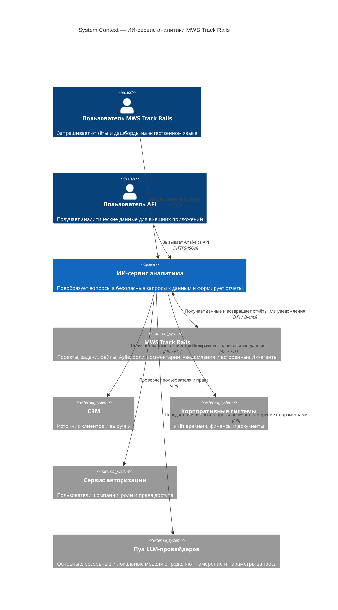

# C4: System Context

Верхнеуровневая схема показывает пользователей ИИ-сервиса аналитики, сам сервис
и внешние системы, с которыми он взаимодействует.

```mermaid
C4Context
    title System Context — ИИ-сервис аналитики MWS Track Rails

    Person(user, "Пользователь MWS Track Rails", "Запрашивает отчёты и дашборды на естественном языке")
    Person(api_client, "Пользователь API", "Получает аналитические данные для внешних приложений")

    System(ai_analytics, "ИИ-сервис аналитики", "Преобразует вопросы в безопасные запросы к данным и формирует отчёты")

    System_Ext(track_rails, "MWS Track Rails", "Проекты, задачи, файлы, Agile, роли, комментарии, уведомления и встроенные ИИ-агенты")
    System_Ext(crm, "CRM", "Источник клиентов и выручки")
    System_Ext(corporate_sources, "Корпоративные системы", "Учёт времени, финансы и документы")
    System_Ext(identity, "Сервис авторизации", "Пользователи, компании, роли и права доступа")
    System_Ext(llm_provider, "Пул LLM-провайдеров", "Основные, резервные и локальные модели определяют намерение и параметры запроса")

    Rel(user, ai_analytics, "Запрашивает аналитику", "HTTPS")
    Rel(api_client, ai_analytics, "Вызывает Analytics API", "HTTPS/JSON")
    Rel(ai_analytics, identity, "Проверяет пользователя и права", "API")
    BiRel(ai_analytics, track_rails, "Получает данные и возвращает отчёты или уведомления", "API / Events")
    Rel(ai_analytics, crm, "Получает данные о клиентах и выручке", "API / ETL")
    Rel(ai_analytics, corporate_sources, "Получает дополнительные данные", "API / ETL")
    Rel(ai_analytics, llm_provider, "Передаёт очищенный запрос и получает намерение с параметрами", "API")

    UpdateLayoutConfig($c4ShapeInRow="3", $c4BoundaryInRow="1")
```
