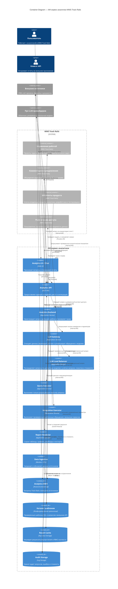

# C4: Container

Контейнерная схема показывает основные исполняемые сервисы и хранилища решения.

```mermaid
C4Container
    title Container Diagram — ИИ-сервис аналитики MWS Track Rails

    Person(user, "Пользователь", "Работает с аналитикой в MWS Track Rails")
    Person(api_client, "Клиент API", "Встраивает отчёты во внешнее приложение")

    System_Ext(external_sources, "Внешние источники", "CRM, учёт времени, финансы и документы")
    System_Ext(llm_provider, "Пул LLM-провайдеров", "Облачные, резервные и локальные модели")

    System_Boundary(track_system, "MWS Track Rails") {
        Container_Ext(track_core, "Управление работой", "MWS Track Rails", "Проекты, задачи, файлы, статусы, спринты и списки задач")
        Container_Ext(track_collab, "Комментарии и уведомления", "MWS Track Rails", "Обсуждения задач и уведомления об изменениях")
        Container_Ext(track_agents, "ИИ-агенты продукта", "MWS Track Rails", "Агенты владельца продукта, аналитика, разработчика и тестировщика")
        Container_Ext(identity, "Роли и права доступа", "MWS Track Rails", "Пользователи, организации, роли и видимость данных")
    }

    System_Boundary(ai_system, "ИИ-сервис аналитики") {
        Container(chat, "Analytics UI / Chat", "Web UI", "Принимает вопросы и показывает отчёты")
        Container(api, "Analytics API", "REST API", "Предоставляет единый интерфейс для UI и интеграций")
        Container(backend, "Analytics Backend", "Application Service", "Оркестрирует запрос, выбирает шаблон и проверяет права")
        Container(llm_gateway, "LLM Gateway", "Application Service", "Очищает данные, формирует prompt и унифицирует обращение к моделям")
        Container(llm_balancer, "LLM Load Balancer", "Application Service", "Распределяет запросы по доступным моделям с учётом нагрузки, лимитов и стоимости")
        Container(executor, "Query Executor", "Application Service", "Выполняет только разрешённые read-only запросы")
        Container(integration_executor, "Integration Executor", "Application Service", "Выполняет проверенные шаблонные обращения к внешним сервисам")
        Container(report, "Report Renderer", "Application Service", "Строит таблицы, графики, дашборды и экспорты")
        Container(ingestion, "Data Ingestion", "Workers / ETL", "Загружает и обновляет данные источников")

        ContainerDb(dwh, "Analytics DWH", "Аналитическая БД", "Витрины Track Rails и внешних источников")
        ContainerDb(templates, "Каталог шаблонов", "Конфигурационное хранилище", "Проверенные шаблоны SQL и запросов к внешним API")
        ContainerDb(cache, "Result Cache", "Key-value Storage", "Кеширует результаты внутри tenant и RBAC-контекста")
        ContainerDb(audit, "Audit Storage", "Log Storage", "Хранит аудит запросов, ошибки и стоимость")
    }

    Rel(user, chat, "Задаёт вопросы и смотрит отчёты", "HTTPS")
    Rel(api_client, api, "Запрашивает аналитику", "HTTPS/JSON")
    Rel(chat, api, "Вызывает", "HTTPS/JSON")
    Rel(track_collab, api, "Передаёт запрос из комментария: этап 2", "Internal API")
    Rel(track_agents, api, "Запрашивают проверенные аналитические показатели", "Internal API")
    Rel(api, identity, "Проверяет токен и права", "API")
    Rel(api, backend, "Передаёт запрос и доверенный контекст доступа", "Internal API")
    Rel(backend, llm_gateway, "Запрашивает анализ намерения и параметров", "Internal API")
    Rel(llm_gateway, llm_balancer, "Передаёт подготовленный запрос", "Internal API")
    Rel(llm_balancer, llm_provider, "Выбирает модель и направляет запрос", "Provider API")
    Rel(backend, templates, "Выбирает шаблон и заполняет разрешённые параметры", "Internal API")
    Rel(backend, cache, "Читает и сохраняет результат", "Cache Protocol")
    Rel(backend, executor, "Передаёт проверенный read-only запрос", "Internal API")
    Rel(backend, integration_executor, "Передаёт проверенный интеграционный запрос", "Internal API")
    Rel(integration_executor, external_sources, "Вызывает разрешённую операцию", "HTTPS/API")
    Rel(executor, dwh, "Выполняет запрос", "SQL")
    Rel(backend, report, "Передаёт данные и вид визуализации", "Internal API")
    Rel(report, api, "Возвращает отчёт или ссылку на экспорт", "Internal API")
    Rel(report, track_collab, "Публикует отчёт или уведомление: этап 2", "Internal API")
    Rel(ingestion, track_core, "Получает изменения задач и проектов", "API / Events")
    Rel(ingestion, external_sources, "Получает данные", "API / ETL")
    Rel(ingestion, dwh, "Обновляет витрины", "Batch / Stream")
    Rel(backend, audit, "Записывает этапы обработки и стоимость", "Events")
    Rel(executor, audit, "Записывает выполнение и ограничения", "Events")

    UpdateLayoutConfig($c4ShapeInRow="3", $c4BoundaryInRow="1")
```
