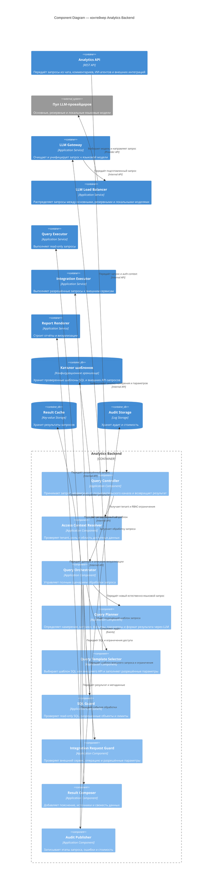

# C4: Component — Analytics Backend

Компонентная схема детализирует контейнер `Analytics Backend`, который управляет
обработкой пользовательского запроса.

```mermaid
C4Component
    title Component Diagram — контейнер Analytics Backend

    Container(api, "Analytics API", "REST API", "Передаёт запросы из чата, комментариев, ИИ-агентов и внешних интеграций")
    System_Ext(llm_pool, "Пул LLM-провайдеров", "Основные, резервные и локальные языковые модели")
    Container(llm_gateway, "LLM Gateway", "Application Service", "Очищает и унифицирует запрос к языковой модели")
    Container(llm_balancer, "LLM Load Balancer", "Application Service", "Распределяет запросы между основными, резервными и локальными моделями")
    Container(executor, "Query Executor", "Application Service", "Выполняет read-only запросы")
    Container(integration_executor, "Integration Executor", "Application Service", "Выполняет разрешённые запросы к внешним сервисам")
    Container(report, "Report Renderer", "Application Service", "Строит отчёты и визуализации")
    ContainerDb(template_catalog, "Каталог шаблонов", "Конфигурационное хранилище", "Хранит проверенные шаблоны SQL и внешних API-запросов")
    ContainerDb(cache, "Result Cache", "Key-value Storage", "Хранит результаты запросов")
    ContainerDb(audit, "Audit Storage", "Log Storage", "Хранит аудит и стоимость")

    Container_Boundary(backend, "Analytics Backend") {
        Component(controller, "Query Controller", "Application Component", "Принимает запрос независимо от пользовательского канала и возвращает результат")
        Component(access, "Access Context Resolver", "Application Component", "Проверяет tenant, роль и область доступных данных")
        Component(orchestrator, "Query Orchestrator", "Application Component", "Управляет полным сценарием обработки запроса")
        Component(planner, "Query Planner", "Application Component", "Определяет намерение, метрики, фильтры, параметры и формат результата через LLM")
        Component(templates, "Query Template Selector", "Application Component", "Выбирает шаблон SQL или внешнего API и заполняет разрешённые параметры")
        Component(sql_guard, "SQL Guard", "Application Component", "Проверяет read-only SQL, разрешённые объекты и лимиты")
        Component(integration_guard, "Integration Request Guard", "Application Component", "Проверяет внешний сервис, операцию и разрешённые параметры")
        Component(composer, "Result Composer", "Application Component", "Добавляет пояснение, источники и свежесть данных")
        Component(audit_publisher, "Audit Publisher", "Application Component", "Записывает этапы запроса, ошибки и стоимость")
    }

    Rel(api, controller, "Передаёт запрос и auth context", "Internal API")
    Rel(controller, access, "Получает tenant и RBAC-ограничения")
    Rel(controller, orchestrator, "Запускает обработку запроса")
    Rel(orchestrator, cache, "Проверяет и сохраняет результат")
    Rel(orchestrator, planner, "Передаёт новый естественно-языковой запрос")
    Rel(planner, llm_gateway, "Запрашивает анализ намерения и параметров", "Internal API")
    Rel(llm_gateway, llm_balancer, "Передаёт подготовленный запрос", "Internal API")
    Rel(llm_balancer, llm_pool, "Выбирает модель и направляет запрос", "Provider API")
    Rel(orchestrator, templates, "Ищет подходящий шаблон запроса")
    Rel(templates, template_catalog, "Читает проверенный шаблон")
    Rel(orchestrator, sql_guard, "Передаёт SQL и ограничения доступа")
    Rel(sql_guard, executor, "Передаёт разрешённый запрос", "Internal API")
    Rel(orchestrator, integration_guard, "Передаёт шаблон внешнего запроса и ограничения")
    Rel(integration_guard, integration_executor, "Передаёт разрешённый запрос", "Internal API")
    Rel(orchestrator, composer, "Передаёт результат и метаданные")
    Rel(composer, report, "Передаёт данные и описание визуализации", "Internal API")
    Rel(orchestrator, audit_publisher, "Передаёт события обработки")
    Rel(audit_publisher, audit, "Сохраняет аудит", "Events")

    UpdateLayoutConfig($c4ShapeInRow="3", $c4BoundaryInRow="1")
```
